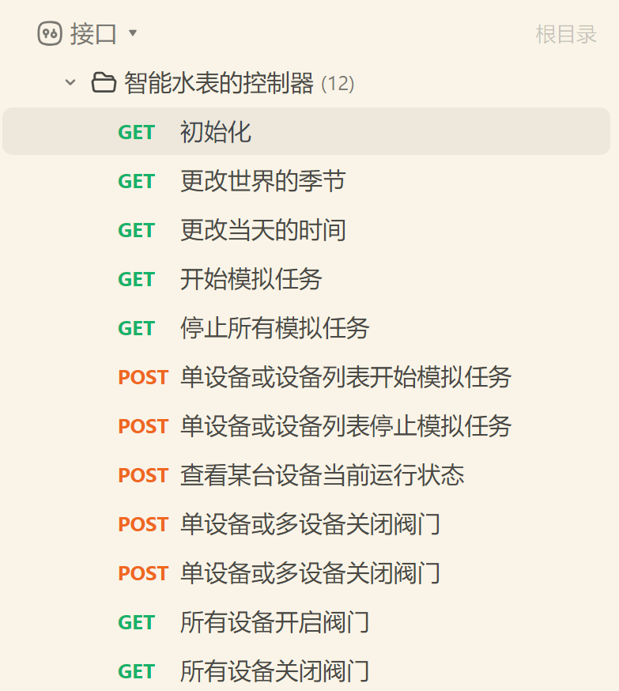
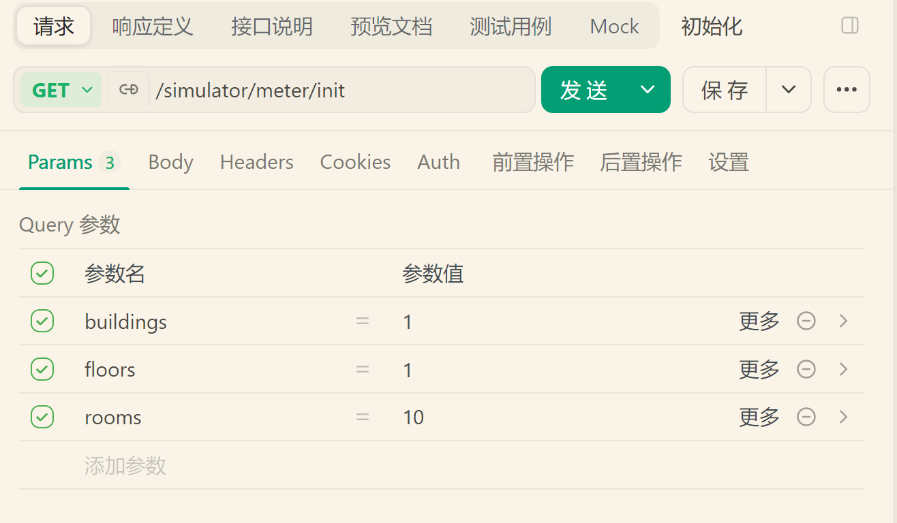
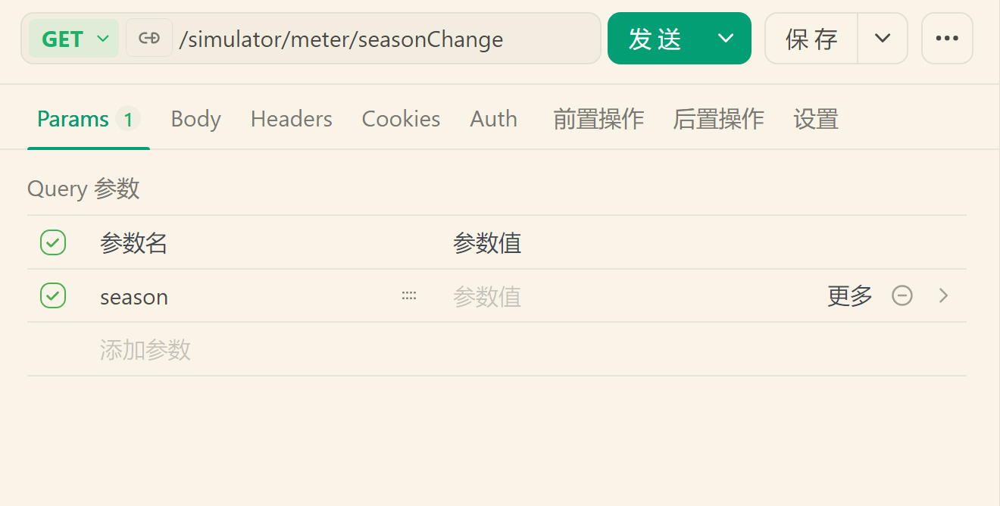
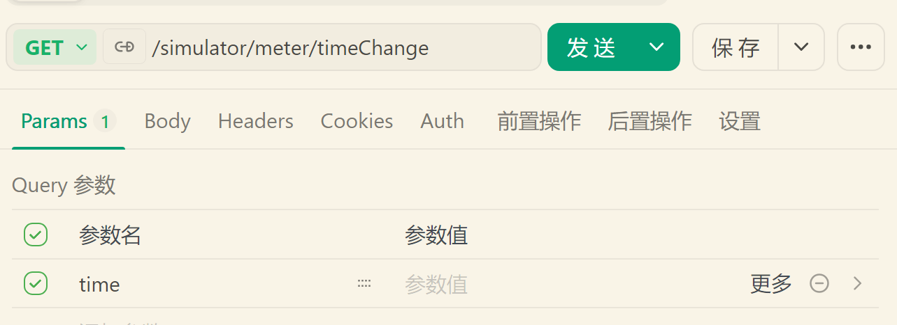
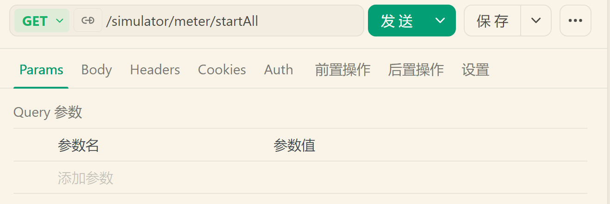

# 此文档展示如何运行此模块😘

## 先决条件：

请在本地部署好Redis服务，并暴露16379端口。**不要设置密码**。

## 接口展示：

## 接口描述：
- `初始化`： 用于注册设备列表。在执行其他操作前，请先执行此操作。

- `更改世界的季节`：季节不同，水温就有所不同。此操作是**可选**的。

- `更改当天的时间`：时间点不一样，流速就不一样。此操作是**可选**的。

- `开始模拟任务`：全部水表设备开始上报数据。执行此操作后，根据nacos中的频率设置，你将会在控制台看到数据流。

剩余接口不再赘述。请自行探索。