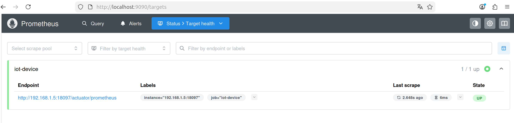
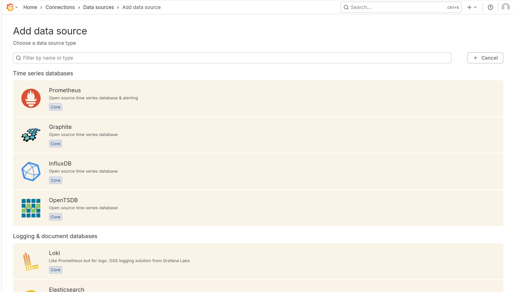
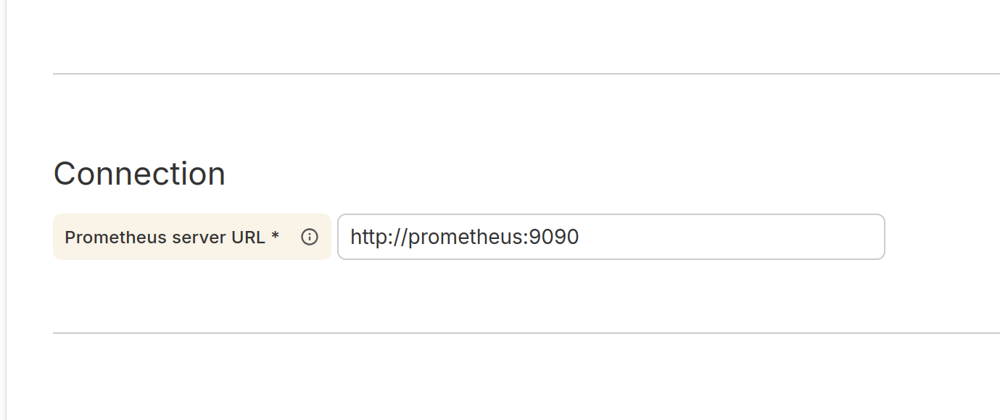

# 开发人员环境搭建指南

该手册将指导如何搭建后端开发环境。

## 先决条件

- **操作系统**：Linux/Windows
- **内存**：至少 8G，推荐 16G
- **CPU**：至少 4 核心
- **Docker**：已安装并运行
- **Nacos，MQ**:已经在远程部署
- **Docker Compose**：推荐安装（可选）

## Linux 环境部署指南

### Docker 部署

#### 1. Redis

```bash
sudo docker run -d \
    --name redission \
    -p 36379:6379 \
    redis:7
```

#### 2. Redis主缓存

```bash
sudo docker run -d \
    --name redis \
    -p 6379:6379 \
    redis:7
```

#### 3. MySQL

```bash
sudo docker run -d \
    --name mysql \
    --hostname=mysql \
    --env=MYSQL_ROOT_PASSWORD=123456 \
    --env=MYSQL_DATABASE=water \
    -v mysql_data:/var/lib/mysql \
    -p 3306:3306 \
    --network=bridge \
    mysql:8.0
```

#### 4. Canal（数据同步）

```bash
sudo docker run -d \
  --name canal \
  --hostname canal \
  --add-host=host.docker.internal:host-gateway \
  --env canal.instance.master.address=host.docker.internal:3306 \
  --env canal.instance.dbUsername=canal \
  --env canal.instance.dbPassword=canal \
  --env canal.instance.connectionCharset=UTF-8 \
  --env canal.instance.filter.regex=.*\\..* \
  --network bridge \
  -p 11111:11111 \
  canal/canal-server:latest
```

#### 5. InfluxDB（时序数据库）

```bash
sudo docker run -d \
    --name influxdb \
    --hostname=influxdb \
    --env=DOCKER_INFLUXDB_INIT_USERNAME=jingxu \
    --env=DOCKER_INFLUXDB_INIT_PASSWORD=jingxu202430904 \
    --env=DOCKER_INFLUXDB_INIT_ORG=ncwu \
    --env=DOCKER_INFLUXDB_INIT_BUCKET=water \
    --env=DOCKER_INFLUXDB_INIT_MODE=setup \
    --network=bridge \
    -v influxdb_data:/var/lib/influxdb2 \
    -p 8086:8086 \
    influxdb:2
```

### 配置说明

#### InfluxDB Token 配置

1. 访问 InfluxDB Web 界面：`http://127.0.0.1:8086`
2. 使用凭据登录：
    - **用户名**：jingxu
    - **密码**：jingxu202430904
3. 生成访问令牌（Token）
4. 在 `IoT-service/ingest-group/src/main/resources/application.yml` 中更新 token

#### 数据库初始化

执行 SQL 脚本初始化数据库：

```bash
# 使用 MySQL 客户端
mysql -h 127.0.0.1 -P 3306 -u root -p123456 < common/src/sql/sql.sql
```

---

## Windows 环境部署指南

### 前置要求

- 安装 [Docker Desktop for Windows](https://www.docker.com/products/docker-desktop/)
- 确保已启动 WSL 2 支持

### Docker 部署

#### 1. Redis（主缓存）

```powershell
docker run -d `
    --name redission `
    -p 36379:6379 `
    redis:7
```

#### 2. Redis（会话存储）

```powershell
docker run -d `
    --name redis `
    -p 6379:6379 `
    redis:7
```

#### 3. MySQL

```powershell
docker run -d `
    --name mysql `
    --hostname=mysql `
    --env=MYSQL_ROOT_PASSWORD=123456 `
    --env=MYSQL_DATABASE=water `
    -v mysql_data:/var/lib/mysql `
    -p 3306:3306 `
    --network=bridge `
    mysql:8.0
```

#### 4. Canal（数据同步）

```powershell
docker run -d `
    --name canal `
    --hostname=canal `
    --env=canal.instance.master.address=host.docker.internal:3306 `
    --env=canal.instance.dbUsername=canal `
    --env=canal.instance.dbPassword=canal `
    --env=canal.instance.connectionCharset=UTF-8 `
    --env=canal.instance.filter.regex=.*\\..* `
    --network=bridge `
    -p 11111:11111 `
    canal/canal-server:latest
```

#### 5. InfluxDB（时序数据库）

```powershell
docker run -d `
    --name influxdb `
    --hostname=influxdb `
    --env=DOCKER_INFLUXDB_INIT_USERNAME=jingxu `
    --env=DOCKER_INFLUXDB_INIT_PASSWORD=jingxu202430904 `
    --env=DOCKER_INFLUXDB_INIT_ORG=ncwu `
    --env=DOCKER_INFLUXDB_INIT_BUCKET=water `
    --env=DOCKER_INFLUXDB_INIT_MODE=setup `
    --network=bridge `
    -v influxdb_data:/var/lib/influxdb2 `
    -p 8086:8086 `
    influxdb:2
```

### 配置说明

#### InfluxDB Token 配置

1. 访问 InfluxDB Web 界面：`http://localhost:8086`
2. 使用凭据登录：
    - **用户名**：jingxu
    - **密码**：jingxu202430904
3. 生成访问令牌（Token）
4. 在 `IoT-service/ingest-group/src/main/resources/application.yml` 中更新 token

#### 数据库初始化

使用 MySQL 客户端工具（如 MySQL Workbench、HeidiSQL 等）或命令行：

```cmd
mysql -h 127.0.0.1 -P 3306 -u root -p123456 < common\src\sql\sql.sql
```

---

## 验证部署

### 检查容器状态

```bash
# Linux/Windows PowerShell
docker ps

# 应该看到以下容器运行：
# - redis-cache
# - redis-session  
# - mysql
# - canal
# - influxdb
```

### 端口检查

| 服务           | 端口    | 用途         |
|--------------|-------|------------|
| Redis (分布式锁) | 36379 | redission锁 |
| Redis (主缓存)  | 6379  | 主缓存        |
| MySQL        | 3306  | 关系型数据库     |
| Canal        | 11111 | 数据同步       |
| InfluxDB     | 8086  | 时序数据库      |

---

### 以下是可选配置：

#### Prometheus（监控服务各项参数，用于运维）

**1. 创建网桥，用于Prometheus和Grafana的容器内通信**

```bash
  docker network create monitor-net
```

**2.将替换为本机的ip**

将IoT-device/prometheus.yml 里的
static_configs:
targets: ['192.168.1.5:18097'] 修改为你自己的ip

**3. 启动 Prometheus**

> 注意：需要替换路径为实际项目路径

```bash
# 确保在 IoT-device 目录执行
  cd <项目根目录>/IoT-device
```

```bash
  docker run -d \
    --name prometheus \
    --network monitor-net \
    -p 9090:9090 \
    -v $(pwd)/prometheus.yml:/etc/prometheus/prometheus.yml \
  prom/prometheus:latest
```

**3. 验证配置**
启动 IoT-device 微服务后，访问：`http://localhost:9090/targets`

若看到目标状态为 UP（如下图），即配置成功。



#### Grafana（用于可视化监控指标）

**1. 启动 Grafana**

```bash
docker run -d --name grafana \
  --network monitor-net \
  -p 3000:3000 \
  grafana/grafana
```

**2. 添加 Prometheus 数据源**
访问：`http://localhost:3000`

- 默认账号密码：`admin/admin`
- 选择 `Prometheus` 作为数据源（如下图）



- 填入 Prometheus 地址：`http://prometheus:9090`



- 点击 `Save & Test`

**3. 代理问题处理**
如果出现代理相关错误，请禁用代理：

```bash
# 删除现有容器
docker rm -f grafana

# 重建容器（禁用代理）
docker run -d --name grafana \
  --network monitor-net \
  -e HTTP_PROXY= \
  -e HTTPS_PROXY= \
  -e http_proxy= \
  -e https_proxy= \
  -e NO_PROXY=localhost,127.0.0.1,prometheus \
  -e no_proxy=localhost,127.0.0.1,prometheus \
  -p 3000:3000 \
  grafana/grafana
```

## 常见问题

### 1. 端口冲突

如果端口被占用，可以修改 `-p` 参数映射到其他端口

### 2. 容器启动失败

检查 Docker 是否正常运行，端口是否被占用

### 3. 数据持久化

使用 Docker volumes 确保数据持久化，容器重启后数据不丢失